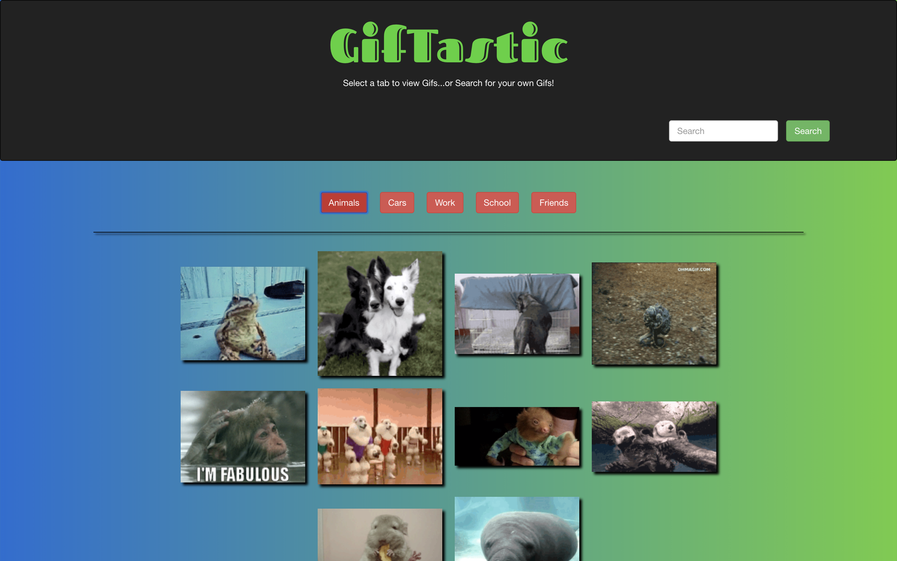

# GifTastic

### Overview
https://unknwndvlpr.github.io/GifTastic/

This fun application uses the GIPHY API to create a dynamic web page that populates with gifs of your choice. 

### Technologies Used:
HTML / CSS / JavaScript / jQuery

